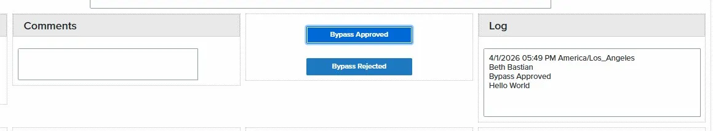

# Button: Field Logging – Audit Trail

A button click script that captures who bypassed or modified a field, stamps a 
timestamp, and writes a formatted log entry into a custom audit trail field. Use 
this when you need a record of manual overrides or exceptions directly inside 
the loan file.



## How it works

**Retrieves the loan and utils objects** — The script calls 
`elli.script.getObject("loan")` to access loan fields and 
`elli.script.getObject("utils")` to access helper methods including the current 
logged-in user's name.

**Captures the current user and timestamp** — Using `utils.getStringValue("currentUserName")`, 
the script identifies who clicked the button. It then builds a formatted 
date/time string from the current moment so the log entry is always accurate.

**Reads the field being logged** — The script reads the current value of the 
field being overridden or bypassed using `loan.getField()`. This value is 
included in the log entry so the audit trail shows what the field contained at 
the time of the action.

**Writes a formatted log entry** — The timestamp, user name, and field value 
are joined into a single string and written into a dedicated custom audit trail 
field using `loan.setFields()`.

## The code

```javascript
async function Button2_click(ctrl) {
  // Retrieve the loan and utils objects
  const loan = await elli.script.getObject("loan");
  const utils = await elli.script.getObject("utils");

  // Get the current logged-in user's name
  const currentUser = await utils.getStringValue("currentUserName");

  // Build a formatted timestamp: MM/DD/YYYY HH:MM:SS
  const now = new Date();
  const date = [
    String(now.getMonth() + 1).padStart(2, "0"),
    String(now.getDate()).padStart(2, "0"),
    now.getFullYear()
  ].join("/");
  const time = now.toLocaleTimeString("en-US", { hour12: false });
  const timestamp = `${date} ${time}`;

  // Read the current value of the field being logged
  const fieldValue = await loan.getField("CX.FIELD.TO.LOG");

  // Build the log entry string
  const logEntry = `${timestamp} | ${currentUser} | ${fieldValue}`;

  // Write the log entry into the audit trail field
  await loan.setFields({ "CX.AUDIT.TRAIL": logEntry });
}
```

## How to use it

1. In Encompass, open your web form in the form builder
2. Add a button and name it `Button2`
3. Paste this code into the button's click event handler
4. Replace `CX.FIELD.TO.LOG` with the field ID of the field you want to log 
   — this is the field whose value will be captured in the audit entry
5. Replace `CX.AUDIT.TRAIL` with the custom field ID where you want the log 
   entry written
6. Save and test by clicking the button on a live loan and checking that the 
   audit trail field populates with the correct timestamp, user, and value

## Notes

- `CX.FIELD.TO.LOG` and `CX.AUDIT.TRAIL` are placeholder field IDs — replace 
  both with your actual custom field IDs from your Encompass environment. 
  Custom fields always start with `CX.`
- The log entry format is `MM/DD/YYYY HH:MM:SS | User Name | Field Value` — 
  adjust the string template in the `logEntry` line if you need a different 
  format
- This script overwrites the audit trail field each time it is clicked. If you 
  need to preserve previous entries, read the existing field value first and 
  append to it before calling `setFields()`
- `utils.getStringValue("currentUserName")` returns the full name of the 
  currently logged-in Encompass user — this matches what you see in the 
  Encompass user management screen
- The timestamp uses the browser's local time — this will reflect the user's 
  machine time zone, so consider documenting this expectation for your team
